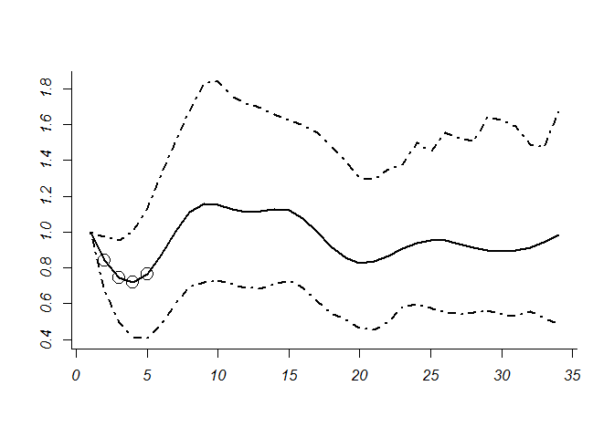

<!-- README.md is generated from README.Rmd. Please edit that file -->
fewster
=======

The goal of fewster is to ...

Installation
------------

You can install the released version of fewster from [CRAN](https://CRAN.R-project.org) with:

``` r
install.packages("fewster")
```

And the development version from [GitHub](https://github.com/) with: B

``` r
# install.packages("devtools")
devtools::install_github("slarge/fewster")
```

Example
-------

This is a basic example which shows you how to solve a common problem:

``` r

# library(mgcv)
# (needed every session to attach the mgcv library)
# If you get an error, read the instructions at
# http://www.stat.auckland.ac.nz/~fewster/gams/R/
# about installing the library mgcv.
library("fewster")
data(cb, package = "fewster")
indcb <- indsp.func(cb, c(4, 7, 10, 15, 20, 33))
#> df  4  complete 
#> df  7  complete 
#> df  10  complete 
#> df  15  complete 
#> df  20  complete 
#> df  33  complete
# (calculates index curve for a variety of df)

cb.bootind.119.10 <- outer.boot.func(cb, 10, 119)
#> [1] 1
#> [1] 2
#> [1] 3
#> [1] 4
#> [1] 5
#> [1] 6
#> [1] 7
#> [1] 8
#> [1] 9
#> [1] 10
#> [1] 11
#> [1] 12
#> [1] 13
#> [1] 14
#> [1] 15
#> [1] 16
#> [1] 17
#> [1] 18
#> [1] 19
#> [1] 20
#> [1] 21
#> [1] 22
#> [1] 23
#> [1] 24
#> [1] 25
#> [1] 26
#> [1] 27
#> [1] 28
#> [1] 29
#> [1] 30
#> [1] 31
#> [1] 32
#> [1] 33
#> [1] 34
#> [1] 35
#> [1] 36
#> [1] 37
#> [1] 38
#> [1] 39
#> [1] 40
#> [1] 41
#> [1] 42
#> [1] 43
#> [1] 44
#> [1] 45
#> [1] 46
#> [1] 47
#> [1] 48
#> [1] 49
#> [1] 50
#> [1] 51
#> [1] 52
#> [1] 53
#> [1] 54
#> [1] 55
#> [1] 56
#> [1] 57
#> [1] 58
#> [1] 59
#> [1] 60
#> [1] 61
#> [1] 62
#> [1] 63
#> [1] 64
#> [1] 65
#> [1] 66
#> [1] 67
#> [1] 68
#> [1] 69
#> [1] 70
#> [1] 71
#> [1] 72
#> [1] 73
#> [1] 74
#> [1] 75
#> [1] 76
#> [1] 77
#> [1] 78
#> [1] 79
#> [1] 80
#> [1] 81
#> [1] 82
#> [1] 83
#> [1] 84
#> [1] 85
#> [1] 86
#> [1] 87
#> [1] 88
#> [1] 89
#> [1] 90
#> [1] 91
#> [1] 92
#> [1] 93
#> [1] 94
#> [1] 95
#> [1] 96
#> [1] 97
#> [1] 98
#> [1] 99
#> [1] 100
#> [1] 101
#> [1] 102
#> [1] 103
#> [1] 104
#> [1] 105
#> [1] 106
#> [1] 107
#> [1] 108
#> [1] 109
#> [1] 110
#> [1] 111
#> [1] 112
#> [1] 113
#> [1] 114
#> [1] 115
#> [1] 116
#> [1] 117
#> [1] 118
#> [1] 119
# (this is the bootstrapping: might take a minute or two for 119
# replicates)

sp.plot("cb", 10, cb.bootind.119.10, 1, 6, 1, conf=0.95)
```



    #> $upturns
    #> [1] 2 3 4 5
    #> 
    #> $downturns
    #> [1] "none"

What is special about using `README.Rmd` instead of just `README.md`? You can include R chunks like so:

``` r
summary(cars)
#>      speed           dist       
#>  Min.   : 4.0   Min.   :  2.00  
#>  1st Qu.:12.0   1st Qu.: 26.00  
#>  Median :15.0   Median : 36.00  
#>  Mean   :15.4   Mean   : 42.98  
#>  3rd Qu.:19.0   3rd Qu.: 56.00  
#>  Max.   :25.0   Max.   :120.00
```

You'll still need to render `README.Rmd` regularly, to keep `README.md` up-to-date.

You can also embed plots, for example:


In that case, don't forget to commit and push the resulting figure files, so they display on GitHub!
